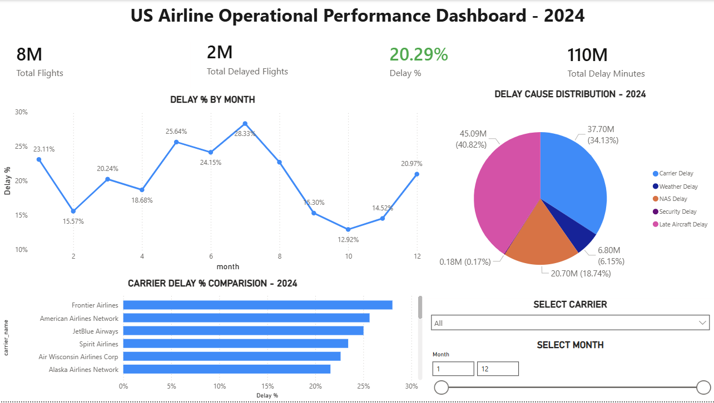

# ✈️ Airline Delay Power BI Dashboard

An interactive minimalistic Power BI dashboard analyzing airline delay trends, delay causes, and carrier performance using MySQL and DAX.

## 📊 Dashboard Preview

## 📊 Features
- Total Flights, Delayed Flights, Delay %
- Monthly delay trend analysis
- Delay cause distribution (Carrier, Weather, NAS, Security, Late Aircraft)
- Carrier performance comparison
- Dynamic filters (Carrier & Month)

## 🛠 Tools Used
- Power BI
- MySQL
- DAX
- Data Modeling

## 📁 Dataset
Airline delay dataset containing flight counts, delay causes, and delay minutes.

---

Developed by Ayush Kumar Singh
